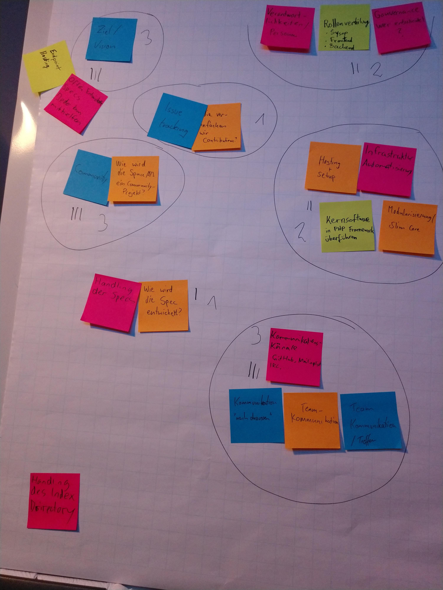

# SpaceAPI Geekend

    Date: Weekend of 2017-10-08
    Location: syn2cat, Luxemburg
    Who: Danilo, Raphi, Romain, Timm

*(Last protocol to be in German, sorry)*

## Themensammlung und Voting

## 1. Interne Kommunikation

### Bisher

 * IRC
 * Mailingliste
 * Github issues/PR (nicht offiziell)

### Ideen

 * Mattermost / Slack?
   * History bleibterhalten
 * IRC?
   * Mattermost hat IRC bridge
   * Wichtig um kontaktierbar zu sein
 * Issue handling
   * Trello / Wekan?
   * Github issues?
 * E-Mail liste?
   * Für den Moment zu aufwändig
   * Existierende weiterverwenden: https://lists.hackerspaces.org/mailman/listinfo/spaceapi-devel

### Entscheidung

 * Mattermost Instanz aufsetzen
   * IRC bridge
   * GitHub issues erstellen
 * "Akkustisch" in Kontakt bleiben
   * 3 Monatliches Teammeeting?
   * Nächstes Meeting am 6./7. Januar
 * Physisch in Kontakt bleiben
   * FOSDEM?
   * 34C3?
   * GPN (Gulasch Programmiernacht)
 * GitHub Gruppe aufräumen
   * Alte inaktive Mitglieder benachrichtigen und entfernen
   * @dbrgn und @rnestler in der GitHub Gruppe hinzufügen
 * Vorerst kein Trello / Wekan sondern auf GitHub issues aufbauen
 * Mailing liste behalten und für announcments verwenden

## 2. Ziel / Vision

### Ziel für dieses Wochenende

 * Timm
   * Eine Website wieder funktional
   * Zeigen dass wir nicht tot sind!
   * Mattermost Instanz online
 * Raphael
   * Klares Ziel für das Projekt definieren
 * Danilo
   * #include\<Timm\>
   * #include\<Raphael\>
 * Romain
   * Kennenlernen
   * In Zukunft ein Team bleiben
   * Sachlich kommunizieren (Keine Flamewars, kein Bikeshedding)
   * Gegenseitiges Verständnis schaffen
   * Alte Funktionsweise wiederherstellen und als Basis für Diskussion verwenden

### Vision für das SpaceAPI Projekt

 * Timm
   * Aktive Community
   * Weit verbreitet
   * Einfacher Einstieg
 * Raphael
   * Offen entwickelte Specs
     * Leute können sich einfach einbringen
     * Diskussion der API fördern
   * Leute können ihren Endpoint eintragen
   * Das Projekt kann problemlos repliziert werden (Wenn der Truck uns alle erwischt, ist das Fortbestehen gewährleistet)
 * Danilo
   * Möglichst viele Spaces sollten es nutzen
   * Ökosystem fördern wo Leute ihre Ideen umsetzen können
     * (3rd party Projekte die auf der API aufbauen)
     * Leute können ihre Projekte einfach veröffentlichen
   * SpaceAPI von der Community getragen werden
     * Mitarbeit einfach ermöglichen
     * Auf Nutzung der SpaceAPI eingehen
     * Core Team sind Maintainer nicht Gatekeeper 
 * Romain
   * Weltherrschaft: Alle Spaces implementieren die API!
   * Hackerspace übergreifendes Projekt
     * Fördert Zusammenarbeit zwischen den Spaces
     * Regelmässiges öffentliches Geekend zum Thema SpaceApi

#### Gemeinsame Vision

 * Weltherrschaft: Alle Spaces implementieren die API!
 * Community kann aktiv mitarbeiten
 * Es ist möglichst einfach, die API zu implementieren und zu nutzen
 * Das Projekt ist nachhaltig und überlebt das Core Team

## 3. Community

 * Siehe auch Vision
 * Contributen erleichtern
   * Easy issues
   * Mentoring
   * Contribution Guidelines
   * Möglichkeit um Coreteam beizutreten
 * Code of Conduct?
 * Sprache
   * Darauf achten dass alles Englisch ist
 * Contributen am Ökosystem erleichtern
 * Leute fördern Projekte umzusetzen
   * Dokumentation
   * How-Tos

### Ideen zur Communitybildung

 * Regelmaessiges Geekend zum Thema SpaceAPI
 * Vorträge
 * Aktuelles Howto

### Entscheidungen

 * Projektsprache: Englisch
 * Wir wollen ein Code of Conduct. Wir werden einen vorgefertigten verwenden (z.B. von GitHub)
 * Code wird auf GitHub entwickelt
   * Möglichkeit für Contributions, auch zum Core, besteht

## 4. Infrastruktur

### Infrastruktur Hosting + Setup

 * Truckfaktor hoch halten
   * Jeder im Coreteam sollte deployen können
   * Änderungen immer reviewen
 * Gut dokumentieren
   * README mit Anleitung
   * Es sollte möglich sein *nur* mit dem Repository die Infrastruktur komplett aufzusetzen

#### Technologien

 * Ansible
   * Gut bekannt bei @dbrgn, @rnestler und @timm
   * ansible-vault ermöglicht, das Repo trotzdem auf GitHub zu haben
 * Docker
   * Gut um Entwicklungsumgebung auch lokal aufzusetzen
   * Einfach zum damit Mattermost, Matterbridge, etc. aufzusetzen
 * Let's Encrypt
 * Caddy
   * Reverse Proxy mit Let's Encrypt integration

### Entscheidungen

 * Wir verwenden Ansible zum Server managen
 * Wir setzen Mattermost mit Docker auf
 * Infrastruktur Repo auch auf GitHub
 * spaceapi.net vorerst nicht auf Docker aufsetzen

## 5. Definition SpaceAPI Core

### Use cases

### Minimal viable product 
 * Spezifikation der API-schema und des Directory-schema
 * Statisches aber editierbares Directory

### Core
 * Spec + Spec Doku
 * Validator
     * Am besten als separater service
 * Directory
     * Tote und ungültige endpoints filtern
     * Aufbauend vom statischen Directory
     * Entlastung der Endpoints durch Caching
     * Cachen von temporär nicht verfügbaren Endpoints
 * Soll Validierung / Caching teil von Core sein?
     * Aufwand für Wartung steigt
     * Ausfallsicherheit?

### Fragen

 * Sollen wir das Directory format spezifizieren?
   * Momentan ist das Format ein wenig unschön, da es ein Objekt mit dynamischen keys ist und kein Array
   * Momentan kein Fokus, da breaking change und zu Aufwändig

## 6. Verantwortlichkeiten / Rollenverteilung

### Was macht wem Spass 

* Danilo
  * Kaum Erfahrung mit PHP
  * Viel Erfahrung mit Python / Django
  * Lieber Backend als Frontend
  * Erfahrung mit Ansible
  * Erfahrung mit Docker
  * TypeScript Erfahrung
* Timm
  * "Full-Stack"
  * Viel Frontend / Backend
  * Deployment / Integration
  * Erfahrung mit Ansible
  * Erfahrung mit Docker
  * Kein Python
* Raphael
  * Weder Front- noch Backend Erfahrung
  * Vereinzelt REST Dienste implementiert
  * Erfahrung mit Ansible
  * Erfahrung mit Docker
  * Erfahrung mit GitHub/Travis/GitLab CI/CD
* Romain
  * Viel PHP Erfahrung
  * Am liebsten Backend-code
  * Twig / Bootstap
  * JavaScript macht seit Angular Spass

### Governance

 * Konsens vs. Konsent
   * Konsens fürt zu langen Entscheidungswegen, da alle glücklich sein müssen
   * Konsent findet eine Lösung mit der alle Leben können
 

### Entscheidungen

 * Entscheidungen werden grundsätzlich nur in der Gruppe getroffen

## 7. Handling des Directories

### Statisches Hosting auf GitHub

Caching darauf aufbauend problemlos möglich.

Vorteile:

 * Failsafe
 * Easy takeover (fork)
 * Öffentlicher single point of truth
 * History öffentlich sichtbar und verifizierbar

Nachteile:

 * Caching nicht forciert

### Dynamisches Hosting auf spaceapi.net

Vorteile:

 * Caching forciert

Nachteile:

 * Nicht failsafe
 * Schwierig zu forken
 * Point of truth nicht öffentlich

### Idee

Im öffentlichen statischen Repo nur eine Liste von URLs. Das mapping von Name
-> URL dann nur auf spaceapi.net zur Verfügung stellen. Da der Name auch im
Inhalt zur Verfügung steht kann das Directory mit dem file jederzeit erstellt
werden.

Vorteile:

 * User werden ermutigt das gecachte Directory von spaceapi.net zu verwenden (Directory muss nicht erstellt werden)

### Use Cases

### Entscheidung

Vorest beiseitelassen. Zuerst mal Infrastruktur in Gang bringen.

Wir verwalten das Directory in einem privaten Repository und machen ein
periodischen E-Mail mit dem Backup (z.B. auf spaceapi-directory-backup @ hackerspaces.org).

**Use-Case neuer / geänderter end-point:**

 1. User erstellt ein issue in einem öffentlichen Repo.
 2. Wir machen ein manuelles Update auf dem Directory Repository

## 9. Handling der Spezifikation

### Vorschläge

 * GitHub issues / pull-requests
 * Selber implementieren

## 10. Ideen für die Spezifikation

 * Multi-Version endpoint
     * Migration zwischen versionen erleichtern
     * Codiert in der URL v0.13/api.json, v0.14/api.json, ...
